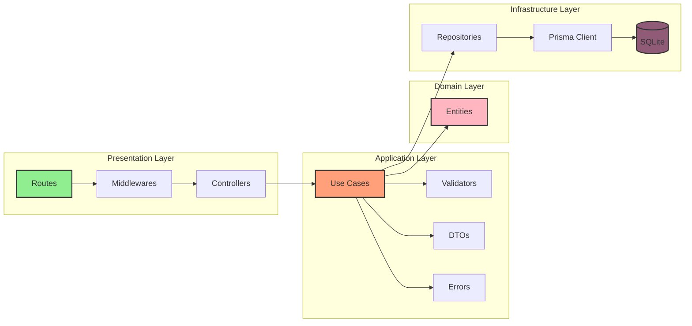

# Diagrama de Arquitetura do Sistema

## Visão Geral da Arquitetura

```mermaid
graph TB
    subgraph "Cliente/Navegador"
        UI[Interface React/Next.js]
    end

    subgraph "Frontend - Next.js 15"
        Pages[Pages/Routes]
        Components[Components UI]
        Hooks[Custom Hooks]
        API_Client[API Client]
        RQ[React Query Cache]
    end

    subgraph "Backend - Express/Node.js"
        Routes[Routes]
        Middleware[Middlewares]
        Controllers[Controllers]
        UseCases[Use Cases]
        Repositories[Repositories]
        Prisma[Prisma Client]
    end

    subgraph "Banco de Dados"
        SQLite[(SQLite DB)]
    end

    subgraph "Infraestrutura"
        Docker[Docker Container]
        Health[Health Check]
    end

    UI --> Pages
    Pages --> Components
    Components --> Hooks
    Hooks --> API_Client
    API_Client --> RQ
    API_Client -->|HTTP/REST| Routes
    
    Routes --> Middleware
    Middleware --> Controllers
    Controllers --> UseCases
    UseCases --> Repositories
    Repositories --> Prisma
    Prisma -->|SQL| SQLite
    
    Routes --> Health
    Docker -.-> Routes
    Docker -.-> Pages

    style UI fill:#61dafb,stroke:#333,stroke-width:2px
    style SQLite fill:#003b57,stroke:#333,stroke-width:2px
    style Docker fill:#2496ed,stroke:#333,stroke-width:2px
```

## Arquitetura em Camadas - Backend

```mermaid
graph LR
    subgraph "Presentation Layer"
        R[Routes] --> MW[Middlewares]
        MW --> C[Controllers]
    end

    subgraph "Application Layer"
        C --> UC[Use Cases]
        UC --> V[Validators]
        UC --> DTO[DTOs]
        UC --> ER[Errors]
    end

    subgraph "Domain Layer"
        UC --> E[Entities]
    end

    subgraph "Infrastructure Layer"
        UC --> REP[Repositories]
        REP --> PRISMA[Prisma Client]
        PRISMA --> DB[(SQLite)]
    end

    style R fill:#90ee90,stroke:#333,stroke-width:2px
    style UC fill:#ffa07a,stroke:#333,stroke-width:2px
    style E fill:#ffb6c1,stroke:#333,stroke-width:2px
    style DB fill:#905b77,stroke:#333,stroke-width:2px
```

## Stack Tecnológica Completa

```mermaid
graph TD
    subgraph "Frontend Stack"
        React[React 18] --> Next[Next.js 15]
        Next --> RHF[React Hook Form]
        Next --> RQ[React Query]
        Next --> TW[TailwindCSS 4]
        TW --> Shadcn[Shadcn/UI]
        Shadcn --> Radix[Radix UI]
    end

    subgraph "Backend Stack"
        Node[Node.js 20] --> TS[TypeScript 5.6]
        TS --> Express[Express 4]
        Express --> PrismaORM[Prisma 5.19]
        Express --> ExpVal[Express Validator]
        Express --> Pino[Pino Logger]
        Express --> Swagger[Swagger UI]
    end

    subgraph "Database"
        PrismaORM --> SQLite[(SQLite)]
    end

    subgraph "DevOps"
        Docker[Docker Multi-stage]
        Compose[Docker Compose]
        HC[Health Check]
    end

    Next -.->|HTTP REST| Express
    Docker --> Node
    Docker --> Next
    Compose --> Docker

    style React fill:#61dafb,stroke:#333,stroke-width:2px
    style Express fill:#90ee90,stroke:#333,stroke-width:2px
    style SQLite fill:#003b57,stroke:#333,stroke-width:2px
    style Docker fill:#2496ed,stroke:#333,stroke-width:2px
```