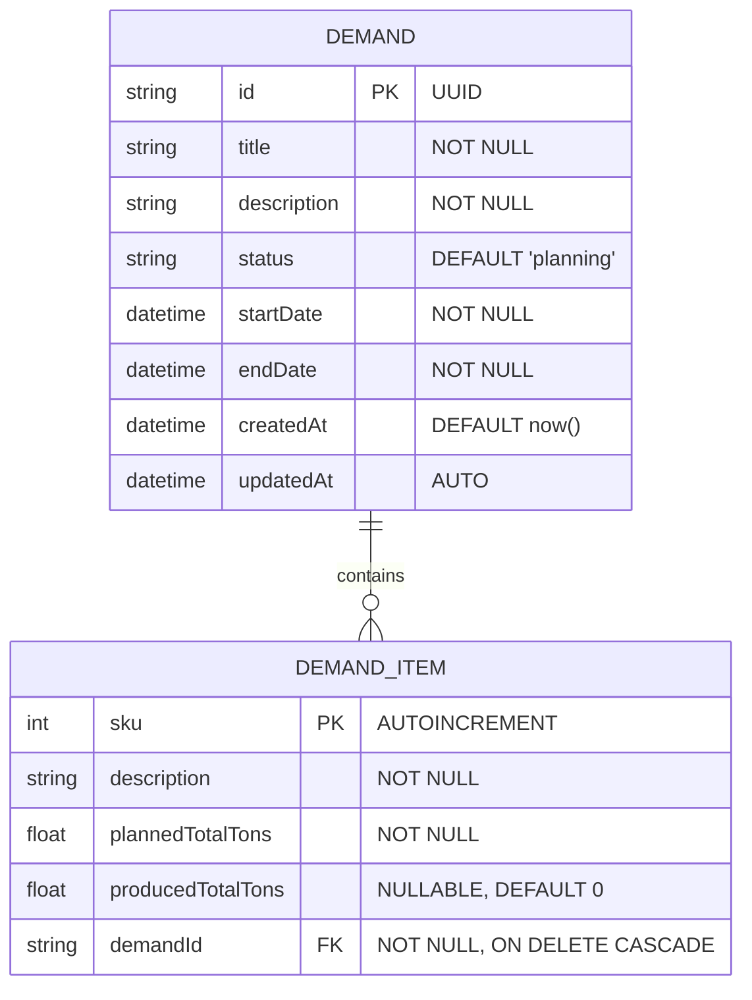
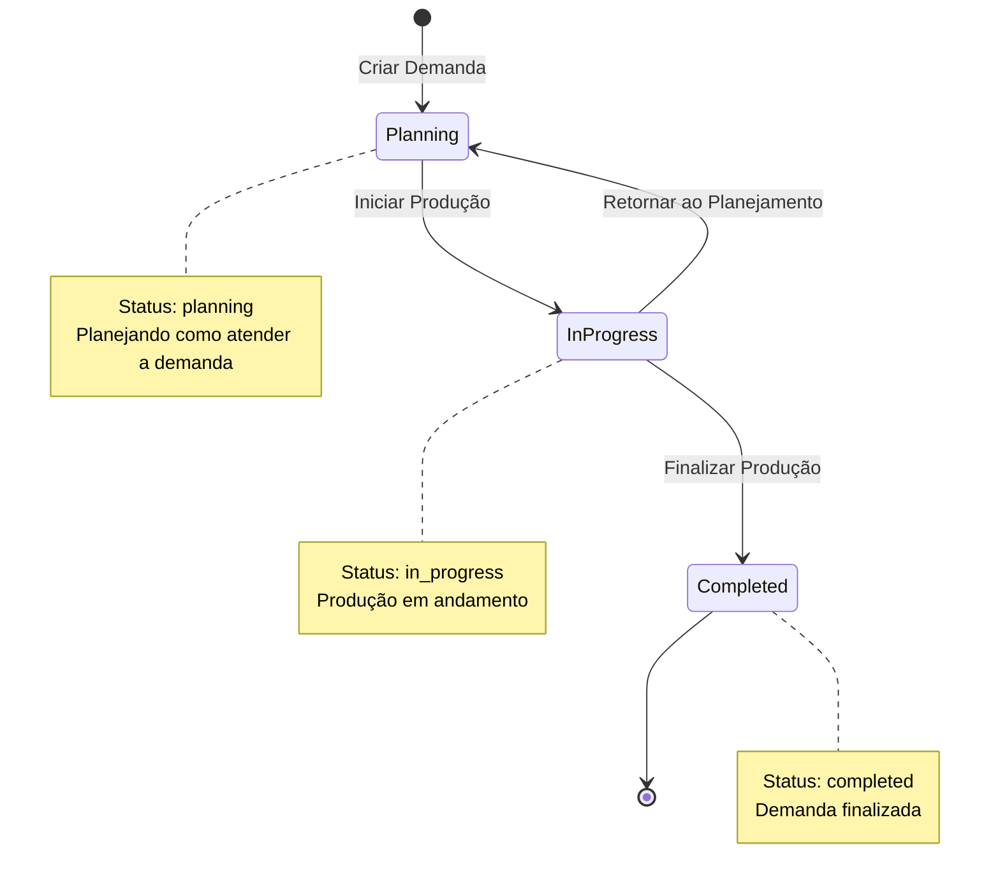

# Diagramas de Entidades e Relacionamentos

## Modelo de Dados (ERD)

```mermaid
erDiagram
    DEMAND ||--o{ DEMAND_ITEM : contains
    
    DEMAND {
        string id PK "UUID"
        string title "NOT NULL"
        string description "NOT NULL"
        string status "DEFAULT 'planning'"
        datetime startDate "NOT NULL"
        datetime endDate "NOT NULL"
        datetime createdAt "DEFAULT now()"
        datetime updatedAt "AUTO"
    }
    
    DEMAND_ITEM {
        int sku PK "AUTOINCREMENT"
        string description "NOT NULL"
        float plannedTotalTons "NOT NULL"
        float producedTotalTons "NULLABLE, DEFAULT 0"
        string demandId FK "NOT NULL, ON DELETE CASCADE"
    }
```
## Estados da Demanda

```mermaid
stateDiagram-v2
    [*] --> Planning: Criar Demanda
    
    Planning --> InProgress: Iniciar Produção
    
    InProgress --> Completed: Finalizar Produção
    InProgress --> Planning: Retornar ao Planejamento
    
    Completed --> [*]

    note right of Planning
        Status: planning
        Planejando como atender a demanda
    end note

    note right of InProgress
        Status: in_progress
        Produção em andamento
    end note

    note right of Completed
        Status: completed
        Demanda finalizada
    end note
```