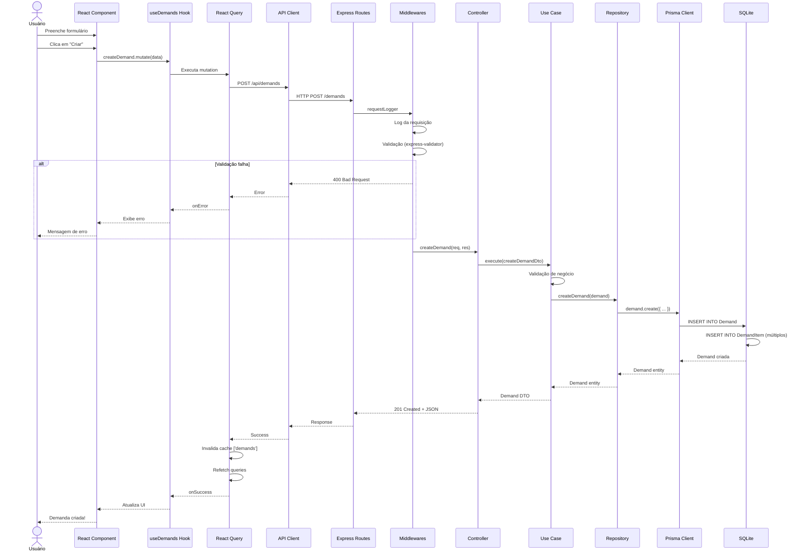
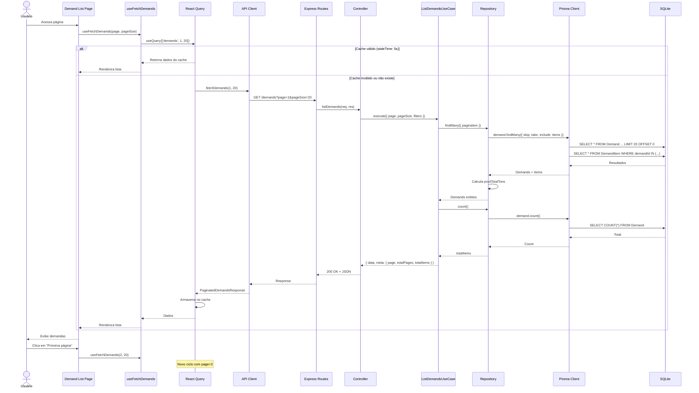
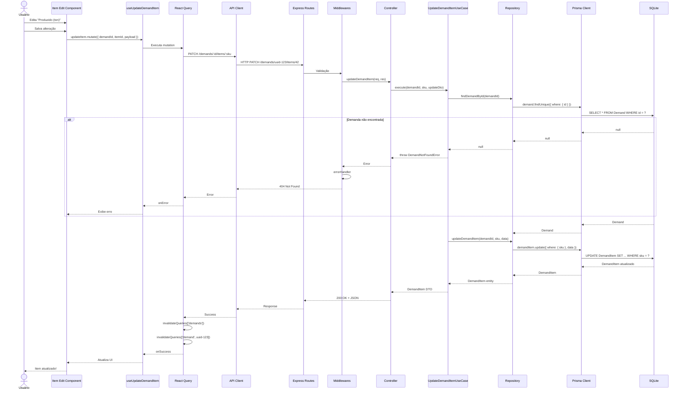
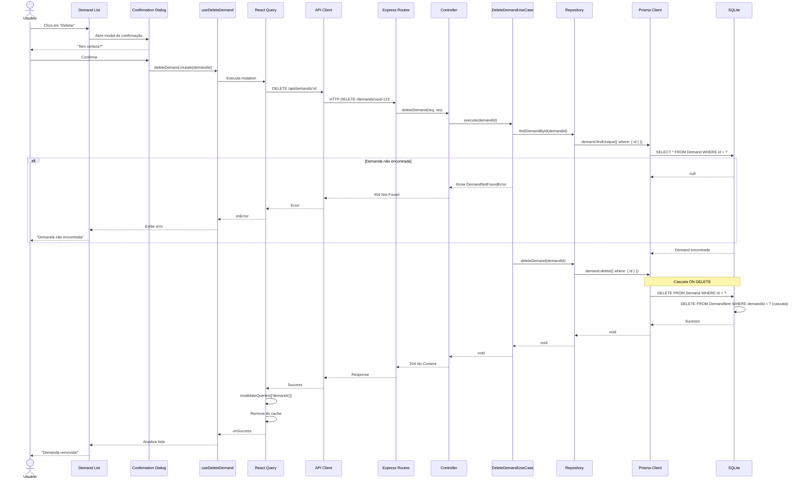
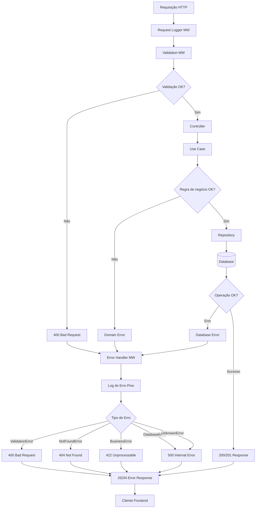
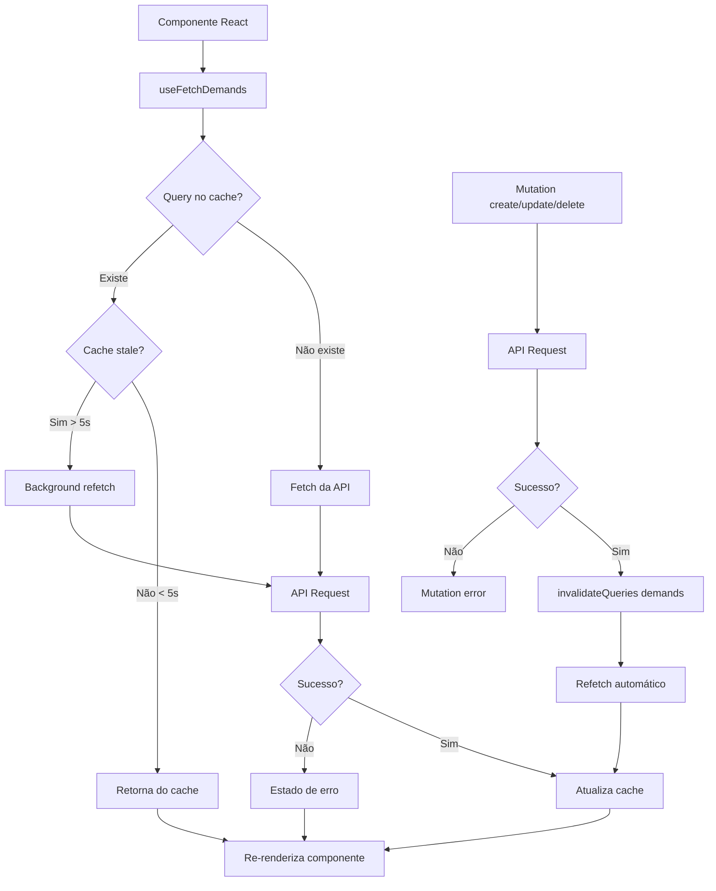

# Diagramas de Fluxo de Requisições

## Fluxo Completo: Criar Demanda

## Fluxo: Listar Demandas (com Paginação)

## Fluxo: Atualizar Item da Demanda

## Fluxo: Deletar Demanda (com Confirmação)

## Fluxo: Tratamento de Erros

## Fluxo de Cache do React Query

